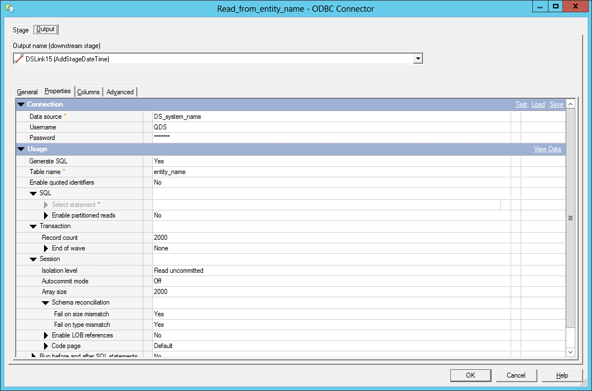
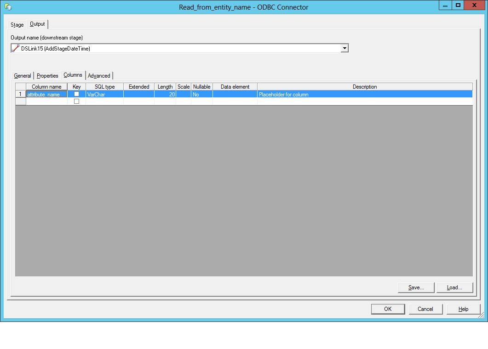
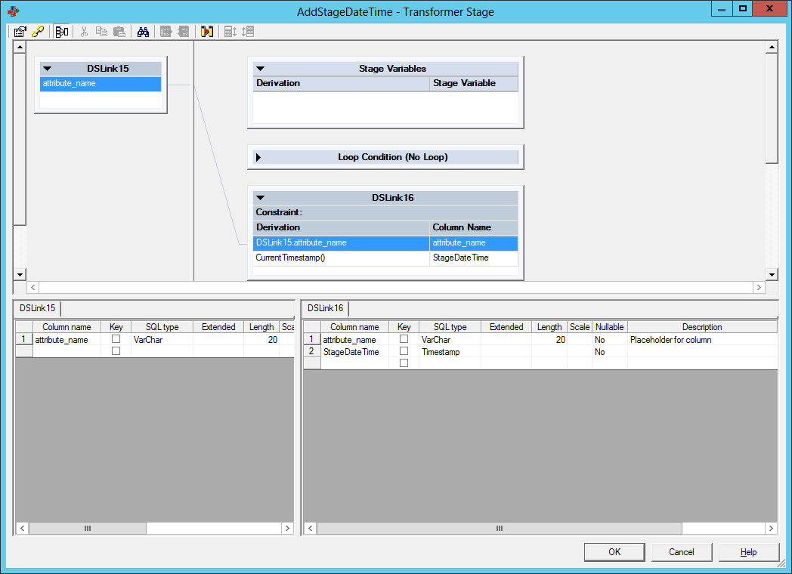
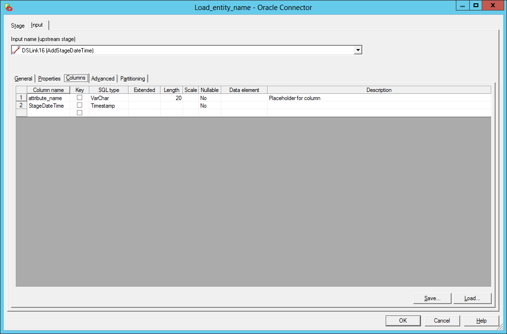

# IBM DataStage - Simple staging example

##Model
Refer to the [Source model](../Model/Source_model).

##Template
The template consists of the following DataStage job:

###Job

####Source(1/2)

####Source(2/2)

!!! todo
    Update screenshot with placeholder.

####Transformation

!!! todo
    Update screenshot with placeholder.

####Target(1/2)

####Target(2/2)

!!! todo
    Update screenshot with placeholder.

## Config

!!! todo
    Add the config file

## Output

!!! todo
    Describe the output