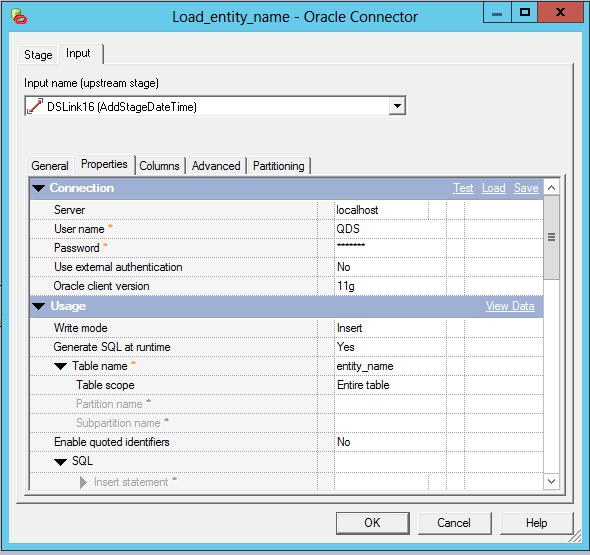
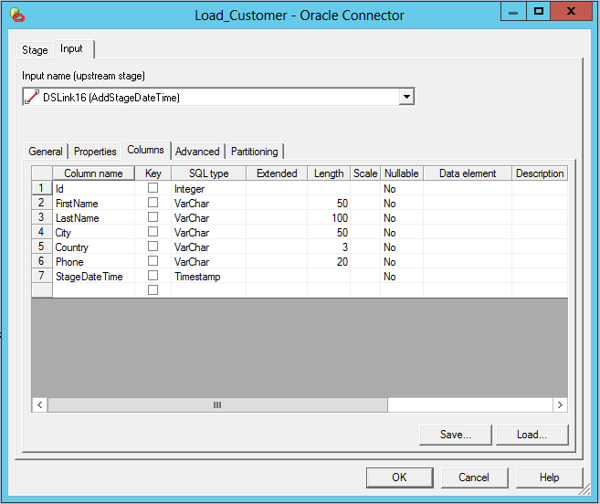

# IBM DataStage - Simple staging example

## Model
Refer to the [Source model](../Model/Source_model).

## Template
The template consists of the following DataStage job:


### Source Stage(1/2)
Opening the Source properties notice that Data source and Table name contain placeholders.


### Source Stage(2/2)
In the Columns tab, there is a column named 'attribute_name' that has another section annotation in the description.


### Transformer Stage
Just as the columns tab in the source properties, the Transformer stage also contains a section annotation in the description of field attribute_name.


### Target Stage(1/2)
The target stage contains a placeholder for Table name


### Target Stage(2/2)
The Columns tab again shows a column attribute_name with a section annotation for a section named "Attribute".


### Documentation
For documentation on templates, please see [Template](../../Template).

## Config

### Enrich the model with DataStage datatypes using Model Attribute Injection
The model used as input for this example contains columns that are specified with a database-datatype (varchar, int, datetime etc).
DataStage uses it's own set of datatypes.
For the model to be used to map to a DataStage template, first the model needs to be enriched with DataStage datatype characteristics.
This model enrichment is done using a specific CrossGenerate feature named Model Attribute Injection.
This feature enables adding attributes to elements in the model.

Model Attribute Injection is configured in the first part of the config shown below: Each database datatype used in the model is mapped to its corresponding DataStage datatype.
This DataStage datatype is stored in the etldatatype XML attribute of the model's attribute.
The xml snippet below shows an example of Model Attribute Injection configuration.

```xml
<ModelAttributeInjection
  modelXPath="//attribute[@datatype='varchar']"
  targetAttribute="etldatatype"
  targetValue="12"
/>
```

### Prepare the DataStage template job using Template Placeholder Injection
Before code can be generated using the DataStage template job and the enriched model, some attributes in the DataStage template that have concrete values need to be populated using a placeholder.

#### Add placeholders to a template using Template Placeholder Injection
When developing a template DataStage job, a lot of elements can be made abstract using DataStage Designer.
This means that for table or column names, a DataStage job can be developed against an abstract datamodel.
So the DataStage job is build using placeholder names, which automatically makes it a template (for example 'attribute_name').

Other elements, for example data types, length & precision cannot be made abstract; the IDE requires you to specify concrete, existing datatypes and lengths for columns.
When applying a model to a template DataStage job, it is required that the data type, length and other characteristics are substituted from the model.
This is only possible if the elements that need to be subsituted contain placeholders in the DataStage template job.

Template Placeholder Injections enables inserting placeholders in a template in parts that cannot be made abstract from the IDE.
An example of a template placeholder injection is shown below:

```xml
<TemplatePlaceholderInjection 
    templateXPath="//SubRecord[Property/text()='attribute_name']/Property[@Name='SqlType']" 
    modelNode="etldatatype" 
    scope="current" 
/>
``` 

The example looks for all `SubRecord` elements that have a `Property` child element with value 'attribute_name' and for these `SubRecord` elements selects the `Property` child element that has `Name` Attribute with value 'SqlType'. For these elements the text value is populated with a placeholder referencing the `etldatatype` attribute from the model.

#### Specifying additional sections
As can be seen in the config below, there is a section defined named `Entity` that references `DSExport/Job`. This section is configured in the config instead of through an annotation in the DataStage Designer.

```xml
<Section 
    name="Entity" 
    templateXPath="DSExport/Job" 
/>
```

### Full config example
```xml
<?xml version="1.0" encoding="UTF-8"?>
<XGenConfig>
  <Model>    
    <ModelAttributeInjections>
       <!-- set etl datatype -->
      <ModelAttributeInjection modelXPath="//attribute[@datatype='VARCHAR']" targetAttribute="etldatatype" targetValue="12"/>
      <ModelAttributeInjection modelXPath="//attribute[@datatype='NVARCHAR']" targetAttribute="etldatatype" targetValue="-9"/>      
      <ModelAttributeInjection modelXPath="//attribute[@datatype='INTEGER']" targetAttribute="etldatatype" targetValue="4"/>
      <ModelAttributeInjection modelXPath="//attribute[@datatype='DATE']" targetAttribute="etldatatype" targetValue="9"/>
      <ModelAttributeInjection modelXPath="//attribute[@datatype='DECIMAL']" targetAttribute="etldatatype" targetValue="3"/>
      <!-- set length and scale where needed -->
      <ModelAttributeInjection modelXPath="//attribute[@datatype='INTEGER']" targetAttribute="length" targetValue="0"/>
      <ModelAttributeInjection modelXPath="//attribute[@datatype='DATE']" targetAttribute="length" targetValue="0"/>
      <ModelAttributeInjection modelXPath="//attribute[@datatype='INTEGER']" targetAttribute="scale" targetValue="0"/>
      <ModelAttributeInjection modelXPath="//attribute[@datatype='DATE']" targetAttribute="scale" targetValue="0"/>
      <ModelAttributeInjection modelXPath="//attribute[@datatype='VARCHAR']" targetAttribute="scale" targetValue="0"/>
      <ModelAttributeInjection modelXPath="//attribute[@datatype='NVARCHAR']" targetAttribute="scale" targetValue="0"/>
      <ModelAttributeInjection modelXPath="//attribute[@datatype='decimal']" targetAttribute="length" targetXPath="./@precision"/>      
     </ModelAttributeInjections>
  </Model>
  <Template rootSectionName="System">
    <FileFormat type="IBM_DataStage" commentNodeXPath="Property[@Name=&quot;Description&quot;]" currentAccessor="_" childAccessor="$" templateType="xml" singleLineCommentPrefix="--" multiLineCommentPrefix="/*" multiLineCommentSuffix="*/" annotationPrefix="@XGen" annotationArgsPrefix="(" annotationArgsSuffix=")" />
    <Output type="output_per_element" />
    <Sections>
      <Section name="Entity" templateXPath="DSExport/Job" />
    </Sections>
    <TemplatePlaceholderInjections>
      <TemplatePlaceholderInjection templateXPath="//SubRecord[Property/text()='attribute_name']/Property[@Name='SqlType']" modelNode="etldatatype" scope="current" />
      <TemplatePlaceholderInjection templateXPath="//SubRecord[Property/text()='attribute_name']/Property[@Name='Precision']" modelNode="length" scope="current" />
      <TemplatePlaceholderInjection templateXPath="//SubRecord[Property/text()='attribute_name']/Property[@Name='Scale']" modelNode="scale" scope="current" />
    </TemplatePlaceholderInjections>
  </Template>
  <Binding>
    <SectionModelBinding section="System" modelXPath = "/modeldefinition/system" placeholderName="system">
      <SectionModelBinding section="Entity" modelXPath="mappableObjects/entity" placeholderName="entity">
        <Placeholders>
          <Placeholder name="system" modelXPath="../.." />                 
        </Placeholders>
        <SectionModelBinding section="Attribute" modelXPath="attributes/attribute" placeholderName="attribute">
          <Placeholders>
            <Placeholder name="system" modelXPath="../../../.." />
            <Placeholder name="entity" modelXPath="../.." />                 
          </Placeholders>    
				</SectionModelBinding>        
			</SectionModelBinding>
    </SectionModelBinding>    
  </Binding>
</XGenConfig>
```

### Documentation
For documentation on the configuration, please see [Config](../../Config).

## Output

When running CrossGenerate with the given model, template job and config, the result is a XML file containing the jobs for the Customer and Order tables specified in the model. The output of the Customer job is illustrated below:

### Job
Notice that the stage names have been changed where the name contained a placeholder


### Input stage
System and table names have been substituted for Data Source and Table name


The columns from the model have been substituted in the stage with the appropriate data type, length, etc. Note that the section annotation is not present in the column's description anymore


### Transformer stage
The transformer stage also has the columns from the model substituted.


### Output stage
Table and columns are substituted in the output stage.





