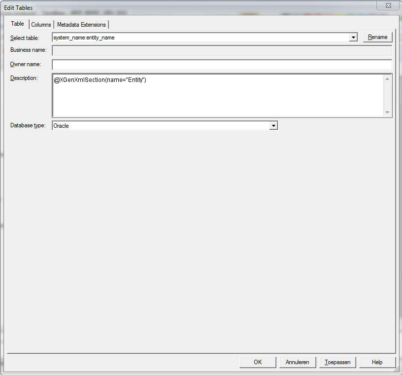
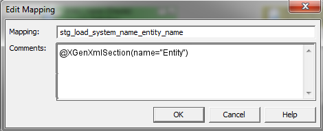
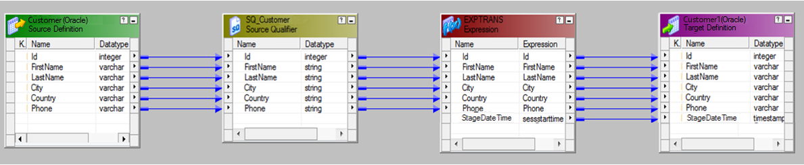

# PowerCenter - Simple staging example

## Model
For this example the [Source model](../../Model/Source_model) is used as a model input.

## Template
As a template a simple mapping is created that copies the data from source to stage table, adding only a stagedatetime field populated with the session start time.

### Source definition
First a source definition is defined. Note the section annotations in the table's and column's description field, this serves as a section marker for CrossGenerate. The config file (see further down in this example) is used to specify the desired processing of this section.

#### Source definition (1/2)


#### Source definition (2/2)


### Target definition
Similar to the source, a target is defined

#### Target definition (1/2)


#### Target definition (2/2)


### With source and target defined, a mapping can be constructed:

#### Mapping (1/4)
[](img/mapping2-37e31f63-8978-4d07-b1ba-0531facc75a4.PNG)

#### Mapping (2/4)


#### Mapping (3/4)


#### Mapping (4/4)


### Template exported to XML
Now the template mapping is created in PowerDesigner. In order to use it with CrossGenerate, the mapping needs to be exported to XML. The export is shown below:
```xml
<?xml version="1.0" encoding="UTF-8"?>
<!DOCTYPE POWERMART SYSTEM "powrmart.dtd">
<POWERMART CREATION_DATE="02/16/2018 20:53:52" REPOSITORY_VERSION="186.95">
<REPOSITORY NAME="REP_REFEC_DEV_01" VERSION="186" CODEPAGE="UTF-8" DATABASETYPE="Oracle">
<FOLDER NAME="Sandbox" GROUP="" OWNER="ottenw" SHARED="NOTSHARED" DESCRIPTION="For testing/prototyping purposes" PERMISSIONS="rwx---r--" UUID="af3f5d20-55dd-47cd-aed9-b6523741ed17">
    <SOURCE BUSINESSNAME="" DATABASETYPE="Oracle" DBDNAME="system_name" DESCRIPTION="@XGenXmlSection(name=&quot;Entity&quot;)" NAME="entity_name" OBJECTVERSION="1" OWNERNAME="" VERSIONNUMBER="1">
        <SOURCEFIELD BUSINESSNAME="" DATATYPE="varchar2" DESCRIPTION="@XGenXmlSection(name=&quot;Attribute&quot;)" FIELDNUMBER="1" FIELDPROPERTY="0" FIELDTYPE="ELEMITEM" HIDDEN="NO" KEYTYPE="NOT A KEY" LENGTH="0" LEVEL="0" NAME="attribute_name" NULLABLE="NULL" OCCURS="0" OFFSET="0" PHYSICALLENGTH="10" PHYSICALOFFSET="0" PICTURETEXT="" PRECISION="10" SCALE="0" USAGE_FLAGS=""/>
    </SOURCE>
    <TARGET BUSINESSNAME="" CONSTRAINT="" DATABASETYPE="Oracle" DESCRIPTION="@XGenXmlSection(name=&quot;Entity&quot;)" NAME="entity_name" OBJECTVERSION="1" TABLEOPTIONS="" VERSIONNUMBER="1">
        <TARGETFIELD BUSINESSNAME="" DATATYPE="varchar2" DESCRIPTION="@XGenXmlSection(name=&quot;Attribute&quot;)" FIELDNUMBER="1" KEYTYPE="NOT A KEY" NAME="attribute_name" NULLABLE="NULL" PICTURETEXT="" PRECISION="10" SCALE="0"/>
        <TARGETFIELD BUSINESSNAME="" DATATYPE="timestamp" DESCRIPTION="" FIELDNUMBER="2" KEYTYPE="NOT A KEY" NAME="StageDateTime" NULLABLE="NULL" PICTURETEXT="" PRECISION="26" SCALE="6"/>
    </TARGET>
    <MAPPING DESCRIPTION="@XGenXmlSection(name=&quot;Entity&quot;)" ISVALID="YES" NAME="stg_load_system_name_entity_name" OBJECTVERSION="1" VERSIONNUMBER="1">
        <TRANSFORMATION DESCRIPTION="" NAME="SQ_entity_name" OBJECTVERSION="1" REUSABLE="NO" TYPE="Source Qualifier" VERSIONNUMBER="1">
            <TRANSFORMFIELD DATATYPE="string" DEFAULTVALUE="" DESCRIPTION="@XGenXmlSection(name=&quot;Attribute&quot;)" NAME="attribute_name" PICTURETEXT="" PORTTYPE="INPUT/OUTPUT" PRECISION="10" SCALE="0"/>
            <TABLEATTRIBUTE NAME="Sql Query" VALUE=""/>
            <TABLEATTRIBUTE NAME="User Defined Join" VALUE=""/>
            <TABLEATTRIBUTE NAME="Source Filter" VALUE=""/>
            <TABLEATTRIBUTE NAME="Number Of Sorted Ports" VALUE="0"/>
            <TABLEATTRIBUTE NAME="Tracing Level" VALUE="Normal"/>
            <TABLEATTRIBUTE NAME="Select Distinct" VALUE="NO"/>
            <TABLEATTRIBUTE NAME="Is Partitionable" VALUE="NO"/>
            <TABLEATTRIBUTE NAME="Pre SQL" VALUE=""/>
            <TABLEATTRIBUTE NAME="Post SQL" VALUE=""/>
            <TABLEATTRIBUTE NAME="Output is deterministic" VALUE="NO"/>
            <TABLEATTRIBUTE NAME="Output is repeatable" VALUE="Never"/>
        </TRANSFORMATION>
        <TRANSFORMATION DESCRIPTION="" NAME="EXPTRANS" OBJECTVERSION="1" REUSABLE="NO" TYPE="Expression" VERSIONNUMBER="1">
            <TRANSFORMFIELD DATATYPE="string" DEFAULTVALUE="" DESCRIPTION="@XGenXmlSection(name=&quot;Attribute&quot;)" EXPRESSION="attribute_name" EXPRESSIONTYPE="GENERAL" NAME="attribute_name" PICTURETEXT="" PORTTYPE="INPUT/OUTPUT" PRECISION="10" SCALE="0"/>
            <TRANSFORMFIELD DATATYPE="date/time" DEFAULTVALUE="ERROR(&apos;transformation error&apos;)" DESCRIPTION="" EXPRESSION="sessstarttime" EXPRESSIONTYPE="GENERAL" NAME="StageDateTime" PICTURETEXT="" PORTTYPE="OUTPUT" PRECISION="29" SCALE="9"/>
            <TABLEATTRIBUTE NAME="Tracing Level" VALUE="Normal"/>
        </TRANSFORMATION>
        <INSTANCE DESCRIPTION="" NAME="entity_name1" TRANSFORMATION_NAME="entity_name" TRANSFORMATION_TYPE="Target Definition" TYPE="TARGET"/>
        <INSTANCE DBDNAME="system_name" DESCRIPTION="" NAME="entity_name" TRANSFORMATION_NAME="entity_name" TRANSFORMATION_TYPE="Source Definition" TYPE="SOURCE"/>
        <INSTANCE DESCRIPTION="" NAME="SQ_entity_name" REUSABLE="NO" TRANSFORMATION_NAME="SQ_entity_name" TRANSFORMATION_TYPE="Source Qualifier" TYPE="TRANSFORMATION">
            <ASSOCIATED_SOURCE_INSTANCE NAME="entity_name"/>
        </INSTANCE>
        <INSTANCE DESCRIPTION="" NAME="EXPTRANS" REUSABLE="NO" TRANSFORMATION_NAME="EXPTRANS" TRANSFORMATION_TYPE="Expression" TYPE="TRANSFORMATION"/>
        <CONNECTOR FROMFIELD="attribute_name" FROMINSTANCE="EXPTRANS" FROMINSTANCETYPE="Expression" TOFIELD="attribute_name" TOINSTANCE="entity_name1" TOINSTANCETYPE="Target Definition"/>
        <CONNECTOR FROMFIELD="StageDateTime" FROMINSTANCE="EXPTRANS" FROMINSTANCETYPE="Expression" TOFIELD="StageDateTime" TOINSTANCE="entity_name1" TOINSTANCETYPE="Target Definition"/>
        <CONNECTOR FROMFIELD="attribute_name" FROMINSTANCE="entity_name" FROMINSTANCETYPE="Source Definition" TOFIELD="attribute_name" TOINSTANCE="SQ_entity_name" TOINSTANCETYPE="Source Qualifier"/>
        <CONNECTOR FROMFIELD="attribute_name" FROMINSTANCE="SQ_entity_name" FROMINSTANCETYPE="Source Qualifier" TOFIELD="attribute_name" TOINSTANCE="EXPTRANS" TOINSTANCETYPE="Expression"/>
        <TARGETLOADORDER ORDER="1" TARGETINSTANCE="entity_name1"/>
        <ERPINFO/>
    </MAPPING>
</FOLDER>
</REPOSITORY>
</POWERMART>
```

### Documentation
For documentation on templates, please see [Template](../../../Template).


## Config
The config contains al the additional information that CrossGenerate needs to combine model and template to working software. The most important functions that are configured are: 

### Enrich the model with PowerCenter datatypes using Model Attribute Injection
The model used as input for this example contains columns that are specified with a database-datatype (varchar, int, datetime etc).
PowerCenter uses it's own set of datatypes.
For the model to be used to map to a PowerCenter template, first the model needs to be enriched with PowerCenter datatype characteristics.
This model enrichment is done using a specific CrossGenerate feature named Model Attribute Injection.
This feature enables adding attributes to elements in the model.

Model Attribute Injection is configured in the first part of the config shown below: Each database datatype used in the model is mapped to its corresponding PowerCenter datatype.
This PowerCenter datatype is stored in the etldatatype XML attribute of the model's attribute.
For some datatypes, such as integer, PowerCenter requires an explicit length where the database datatype does not. This can also be achieved using Model Attribute Injection. 

The xml snippet below shows an example of Model Attribute Injection configuration.

```xml
<ModelAttributeInjection
  modelXPath="//attribute[@datatype='varchar']" 
  targetAttribute="etldatatype" 
  targetValue="string"
/>
<ModelAttributeInjection
  modelXPath="//attribute[@datatype='int']" 
  targetAttribute="length" 
  targetValue="10"
/>
```

### Prepare the PowerCenter template mapping using Template Placeholder Injection
Before code can be generated using the PowerCenter template mapping and the enriched model, some alterations need to be performed on the template mapping.
When developing a template PowerCenter mapping, a lot of elements can be made abstract using PowerCenter Designer.
This means that for table or column names, a mapping can be developed against an abstract datamodel so the mapping is build using placeholder names, which automatically makes it a template.
Other elements, for example data types, length & precision cannot be made abstract; the IDE requires you to specify concrete, existing datatypes and lengths for columns.

When applying a model to a template PowerCenter mapping, it is required that the data type, length and other characteristics are substituted from the model.
This is only possible if the elements that need to be subsituted contain placeholders in the PowerCenter template mapping.

Template Placeholder Injection enables inserting placeholders in a template in parts that cannot be made abstract from the IDE.
An example of a template placeholder injection is shown below:

```xml
<TemplatePlaceholderInjection
  templateXPath="//SOURCEFIELD[@NAME='attribute_name']/@DATATYPE" 
  modelNode="datatype" 
  scope="current"
/>
<TemplatePlaceholderInjection 
  templateXPath="//TRANSFORMFIELD[@NAME='attribute_name']/@DATATYPE"  
  modelNode="etldatatype" 
  scope="current"
/>
```

The first line in the example puts a placeholder referencing the `datatype` attribute from the model in each `DATATYPE` attribute of `SOURCEFIELD` elements.
The second line creates a placeholder for `etldatatype` in each `DATATYPE` attribute of `TRANSFORMIELD` elements.

!!! note
    For `SOURCEFIELD` the database datatype is used, but for `TRANSFORMFIELD` the etldatatype is used that was added using Model Attribute Injection. 

#### Specifying additional sections
As can be seen in the config below, there is a section defined named `Attribute` that references Connector elements that have the placeholder `attribute_name` as `FROMFIELD` attribute value.
This is done through the config since connectors cannot be annotated with a section annotation using PowerCenter Designer.

```xml
<XmlSection
  templateXPath="//MAPPING/CONNECTOR[@FROMFIELD='attribute_name']" 
  name="Attribute"
/>
```

### Full config example
```xml
<?xml version="1.0" encoding="UTF-8"?>
<XGenConfig>
  <Model>    
    <ModelAttributeInjections>
      <!-- set etl datatype -->
      <ModelAttributeInjection modelXPath="//attribute[@datatype='varchar']" targetAttribute="etldatatype" targetValue="string"/>
      <ModelAttributeInjection modelXPath="//attribute[@datatype='nvarchar']" targetAttribute="etldatatype" targetValue="nstring"/>      
      <ModelAttributeInjection modelXPath="//attribute[@datatype='int']" targetAttribute="etldatatype" targetValue="integer"/>
      <ModelAttributeInjection modelXPath="//attribute[@datatype='datetime']" targetAttribute="etldatatype" targetValue="date/time"/>
      <ModelAttributeInjection modelXPath="//attribute[@datatype='decimal']" targetAttribute="etldatatype" targetValue="decimal"/>
      <!-- set length, precision and scale where needed -->
      <ModelAttributeInjection modelXPath="//attribute[@datatype='int']" targetAttribute="length" targetValue="10"/>
      <ModelAttributeInjection modelXPath="//attribute[@datatype='int']" targetAttribute="precision" targetValue="10"/>
      <ModelAttributeInjection modelXPath="//attribute[@datatype='datetime']" targetAttribute="length" targetValue="23"/>
      <ModelAttributeInjection modelXPath="//attribute[@datatype='datetime']" targetAttribute="precision" targetValue="23"/>
      <ModelAttributeInjection modelXPath="//attribute[@datatype='datetime']" targetAttribute="scale" targetValue="3"/>      
      <!-- set precision for text fields -->
      <ModelAttributeInjection modelXPath="//attribute[@datatype='varchar']" targetAttribute="precision" targetXPath="./@length"/>
      <ModelAttributeInjection modelXPath="//attribute[@datatype='nvarchar']" targetAttribute="precision" targetXPath="./@length"/> 
      <!--  set etl precision & scale-->
      <ModelAttributeInjection modelXPath="//attribute" targetAttribute="etlprecision" targetXPath="./@length"/>      
      <ModelAttributeInjection modelXPath="//attribute" targetAttribute="etlscale" targetValue="0"/>
      <ModelAttributeInjection modelXPath="//attribute[@datatype='decimal']" targetAttribute="etlprecision" targetXPath="./@precision"/>      
      <ModelAttributeInjection modelXPath="//attribute[@datatype='decimal']" targetAttribute="etlscale" targetXPath="./@scale"/>    
      <ModelAttributeInjection modelXPath="//attribute[@datatype='datetime']" targetAttribute="etlprecision" targetValue="29"/>
      <ModelAttributeInjection modelXPath="//attribute[@datatype='datetime']" targetAttribute="etlscale" targetValue="9"/>        
    </ModelAttributeInjections>
  </Model>
  <XmlTemplate rootSectionName="System">
    <FileFormat type="Informatica_PowerCenter" commentNodeXPath="@DESCRIPTION" currentAccessor="_" childAccessor="$" singleLineCommentPrefix="--" multiLineCommentPrefix="/*" multiLineCommentSuffix="*/" annotationPrefix="@XGen" annotationArgsPrefix="(" annotationArgsSuffix=")" />
    <Output type="single_output" />
    <XmlSections>
      <!--
        A section name can be specified multiple times. This way the binded model elements will be bound for all sections with the same name.
        In this example the 'Attribute' section is specified multiple times in the template, it here it is again specified from the config.
        For explanation on the XPath syntax see:
          - https://www.w3schools.com/xml/xpath_syntax.asp
       -->
      <XmlSection templateXPath="//MAPPING/CONNECTOR[@FROMFIELD='attribute_name']" name="Attribute"/>
    </XmlSections>
    <TemplatePlaceholderInjections>
      <!--
        The scope in the placeholder injection defines at what level placeholder will be resolved.
        This can be either current or child (current is current element attributes and child is current element child elements).
        In the first example we inject a placeholder in the DATATYPE attribute on the SOURCEFIELD element.
        The full placeholder will be <section-placeholderName><scope-accessor><modelNode>.
        In the first example it will be attribute_datatype.
       -->
      <TemplatePlaceholderInjection templateXPath="//SOURCEFIELD[@NAME='attribute_name']/@DATATYPE" modelNode="datatype" scope="current" />
      <TemplatePlaceholderInjection templateXPath="//SOURCEFIELD[@NAME='attribute_name']/@LENGTH" modelNode="length" scope="current" />
      <TemplatePlaceholderInjection templateXPath="//SOURCEFIELD[@NAME='attribute_name']/@PRECISION" modelNode="precision" scope="current" />
      <TemplatePlaceholderInjection templateXPath="//SOURCEFIELD[@NAME='attribute_name']/@SCALE" modelNode="scale" scope="current" />
      <TemplatePlaceholderInjection templateXPath="//TARGETFIELD[@NAME='attribute_name']/@DATATYPE" modelNode="datatype" scope="current" />
      <TemplatePlaceholderInjection templateXPath="//TARGETFIELD[@NAME='attribute_name']/@LENGTH" modelNode="length" scope="current" />
      <TemplatePlaceholderInjection templateXPath="//TARGETFIELD[@NAME='attribute_name']/@PRECISION" modelNode="precision" scope="current" />
      <TemplatePlaceholderInjection templateXPath="//TARGETFIELD[@NAME='attribute_name']/@SCALE" modelNode="scale" scope="current" />      
      <TemplatePlaceholderInjection templateXPath="//TRANSFORMFIELD[@NAME='attribute_name']/@DATATYPE"  modelNode="etldatatype" scope="current" />
      <TemplatePlaceholderInjection templateXPath="//TRANSFORMFIELD[@NAME='attribute_name']/@LENGTH"  modelNode="etllength" scope="current" />
      <TemplatePlaceholderInjection templateXPath="//TRANSFORMFIELD[@NAME='attribute_name']/@PRECISION"  modelNode="etlprecision" scope="current" />
      <TemplatePlaceholderInjection templateXPath="//TRANSFORMFIELD[@NAME='attribute_name']/@SCALE"  modelNode="etlscale" scope="current" />
    </TemplatePlaceholderInjections>
  </XmlTemplate>
  <Binding>
    <!-- Configure the bindings on which models elements are bound to a specific section. -->
    <SectionModelBinding section="System" modelXPath = "/modeldefinition/system" placeholderName="system">
      <!--
        Section bindings can be specified recursively.
        For example entities exists within a system to it makes sense the binding is also defined inside the System section binding.
        The modelXPath here is relative to its parent binding.
       -->
      <SectionModelBinding section="Entity" modelXPath="mappableObjects/entity" placeholderName="entity">
        <Placeholders>
          <!-- For the placeholder the modelXPath is relative to its section model XPath. -->
          <Placeholder name="system" modelXPath="../.." />                 
        </Placeholders>
        <SectionModelBinding section="Attribute" modelXPath="attributes/attribute" placeholderName="attribute">
          <Placeholders>
            <Placeholder name="system" modelXPath="../../../.." />
            <Placeholder name="entity" modelXPath="../.." />                 
          </Placeholders>    
				</SectionModelBinding>        
			</SectionModelBinding>
    </SectionModelBinding>    
  </Binding>
</XGenConfig>
```

### Documentation
For documentation on the configuration, please see [Config](../../../Config).


## Output
When running CrossGenerate with the given model, template and config an XML file is generated that contains source and target definitions and mappings for the Order and Customer table.
When imported in PowerCenter, the customer mapping is as displayed in the screenshot below:

[](img/Mapping_output.png)
