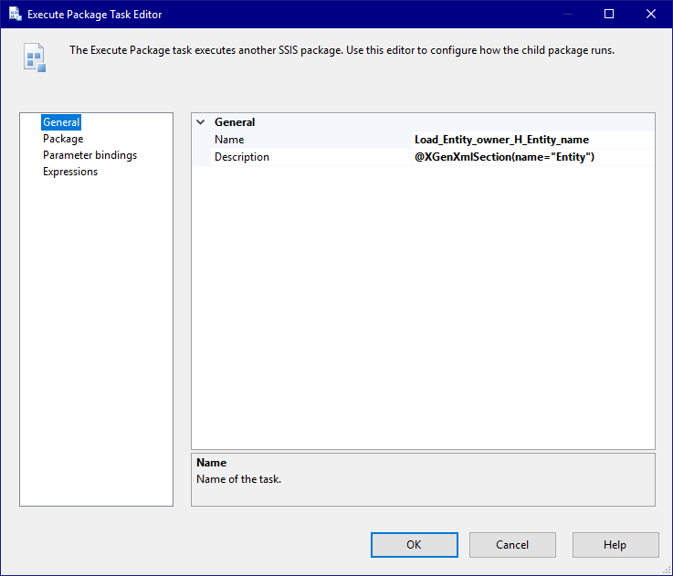
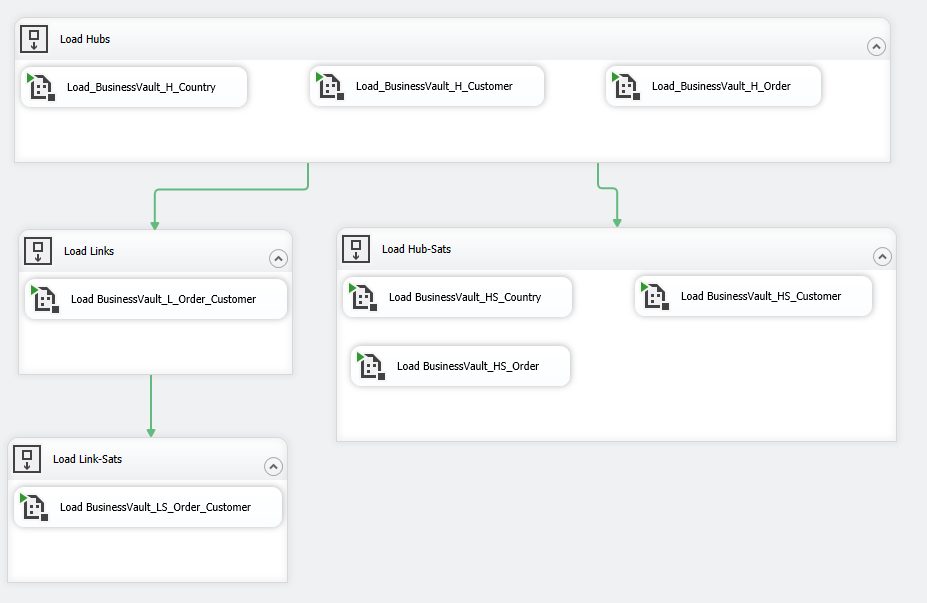
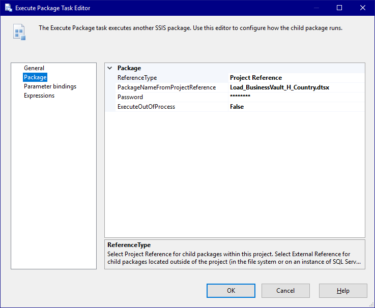

# Microsoft SSIS - DataVault - Master package
In this example the master package for the [DataVault](../../DataVault) solution is described.

## Model
See [DWH Model](../../../Model/DWH_model).

## Template
### Load_DWH_DataVault.dtsx

This package is the orchestration package that executes the all Hub, Hub-Sat, Link, and Link-Sat packages in the appropriate order. The package consists of the following components:

#### Control Flow
The control flow contains sequence containers for the different types of packages and ensures the load order is correct (hubs before links and Hub-sats, links before Link-sats).
[](img/master_control_flow.png)

#### Execute package tasks
Each execute package task refers to one of the template packages, for instance the Hub or Hub-Sat loading package described in the previous pages. Each execute package task has the appropriate section annotation in the description (either Entity or Relation)

##### Execute package task for Hub


##### Execute package task for Link


### Documentation
For documentation on templates, please see [Template](../../../../Template).

## Config
For generating a master package less config is needed when compared to generating Hub and Hub-Sat packages. This is due to the fact that less information from the model is needed to generate the master package. As can be seen in the config below we:

- Inject a new attribute in the model to supply each entity, and relation with a keyPackageId and a nonKeyPackageId. These are needed to provide each execute package task a unique identifier, something that SSIS requires.
- Substitute the DTSID, the unique identifier of each execute package task, with a placeholder so CrossGenerate can substitute the appropriate packageID that was injected in the model earlier.
- Bind the sections to the appropriate model elements.

``` xml
<?xml version="1.0" encoding="UTF-8"?>
<XGenConfig>
 <Model>
    <ModelAttributeInjections>
      <!-- Create new model attributes for Key and NonKey package ID's populate it with the internalId, enclosed in brackets and prefixed with either H or S. -->
      <ModelAttributeInjection modelXPath="//mappableObjects/*[@internalId]" targetAttribute="keyPackageId" targetXPath="concat('{H', @internalId, '}')"/>
      <ModelAttributeInjection modelXPath="//mappableObjects/*[@internalId]" targetAttribute="nonKeyPackageId" targetXPath="concat('{S', @internalId, '}')"/>
    </ModelAttributeInjections>
  </Model>
  <XmlTemplate rootSectionName="System">
    <FileFormat currentAccessor="_" annotationPrefix="@XGen" commentNodeXPath="@Description" annotationArgsPrefix="(" annotationArgsSuffix=")" />
    <Output type="single_output" />
     <TemplatePlaceholderInjections>
      <!-- Inject a placeholder for the ID property for the packages. -->
      <TemplatePlaceholderInjection templateXPath="//Executable[@refId='Package\Load Hubs\Load_Entity_owner_H_Entity_name']/@DTSID" modelNode="keyPackageId" scope="current" />
      <TemplatePlaceholderInjection templateXPath="//Executable[@refId='Package\Load Hub-Sats\Load Entity_owner_HS_Entity_name']/@DTSID" modelNode="nonKeyPackageId" scope="current" />
      <TemplatePlaceholderInjection templateXPath="//Executable[@refId='Package\Load Links\Load Relation_owner_L_Relation_name']/@DTSID" modelNode="keyPackageId" scope="current" />
      <TemplatePlaceholderInjection templateXPath="//Executable[@refId='Package\Load Link-Sats\Load Relation_owner_LS_Relation_name']/@DTSID" modelNode="nonKeyPackageId" scope="current" />
    </TemplatePlaceholderInjections>
  </XmlTemplate>
  <Binding>
    <SectionModelBinding section="System" modelXPath="/modeldefinition/system" placeholderName="System">
      <SectionModelBinding section="Entity" modelXPath="mappableObjects/entity" placeholderName="Entity" />
      <SectionModelBinding section="Relation" modelXPath="mappableObjects/relation" placeholderName="Relation" />
    </SectionModelBinding>
  </Binding>
</XGenConfig>
```

## Output
When running CrossGenerate with the given Model, Template and Config, a package named Load_DWH_DataVault.dtsx is created containing an execute package task for all of the generated packages in the appropriate sequence container.

#### Control Flow
The control flow now contains execute package tasks for each generated package.

[](img/master_output_control_flow.png)

#### Execute package tasks
Each execute package task refers to one of the generated packages.

