# Microsoft SSIS - Simple staging example

## Model
For this stage package the [Source model](../Model/Source_model) is used.

## Template

### stg_load_system_name_entity_name.dtsx

A SSIS package is created with the following components (note the @XGenSection annotations in the description fields of various components):

#### Control Flow
We have a staging package which needs to be created for every entity in our model. Because of this we want the create a section using the Control Flow of the SSIS package. So we click on the grey area of the package and add the annotation `@XGenSection(name="stgPackage")` in the `Description` property.

On the Control Flow we have a Data Flow Task with the name 'Load entity_name'. In the configuration for CrossGenerate we will bind the `entity` elements on the `stgPackage` section so the `entity_name` is resolved correctly.

[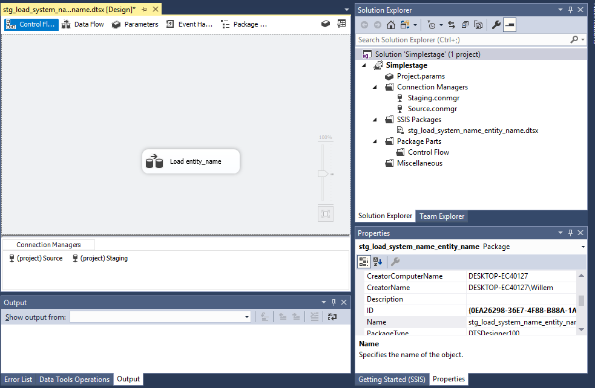](img/control_flow.png)

#### Data Flow
In the DataFlow task of this template we have:
- A OLE DB Source component to retrieve the data from the source table
- A Derive Column component to add the StageDateTime as a column to the output
- A OLE DB Destination component to write the data to the Destination table.

Here the `system_name` and `entity_name` placeholders will be resolved automatically, since these component are withing the `stgPackage` section.


##### Source
In the OLE DB Source component we go through the different screens and set the CrossGenerate annotations accordingly.

###### Connection Manager
In the connection manager screen we don't need to set anything specific for CrossGenerate, we make sure the connection is set correctly and the right source table is selected.

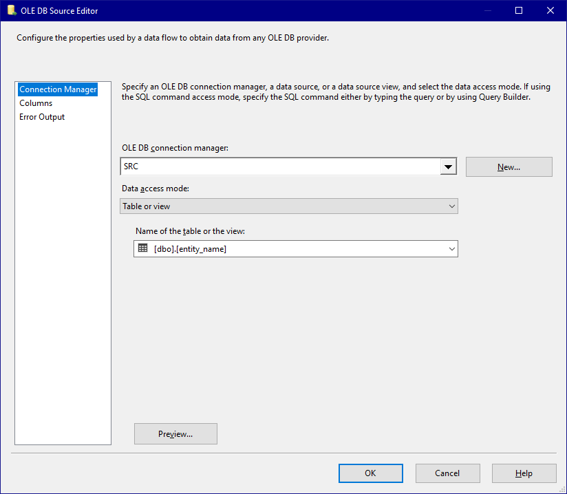

###### Columns
In the 'Columns' tab here we also don't need to set anything specific for CrossGenerate. The attribute which needs to be repeated for every attribute in the model needs to be there and selected. We can't specify a section here in this  screen, but we will do this using the  Advanced Editor of the source component.

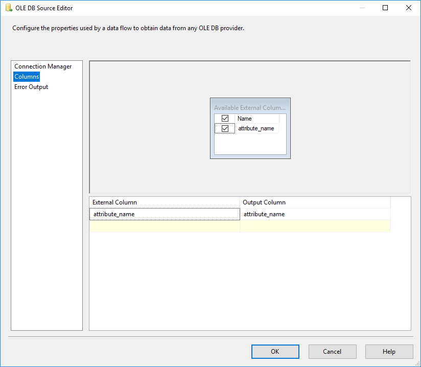

###### Input and Output Properties - External Columns
When opening the Advanced Editor for the source component we can go to the 'Input and Output Properties' tab to find the 'attribute_name' column in the 'External Columns' list.
The defined output column needs to be repeated for every attribute in our model, so we set the section named 'Attribute' on the [External Columns/attribute_name] element. This way CrossGenerate knows which part in the template to repeat (in this case the [attribute_name] column).

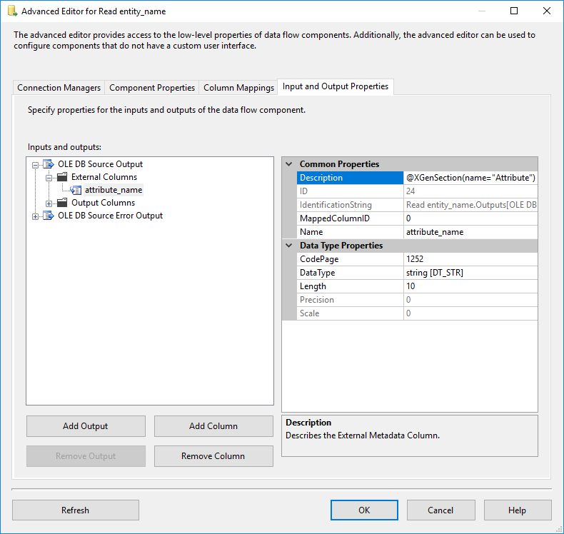

###### Input and Output Properties - Output Columns
We do the same for the 'Output Columns', since this column also needs to be repeat for every attribute defined in the model.

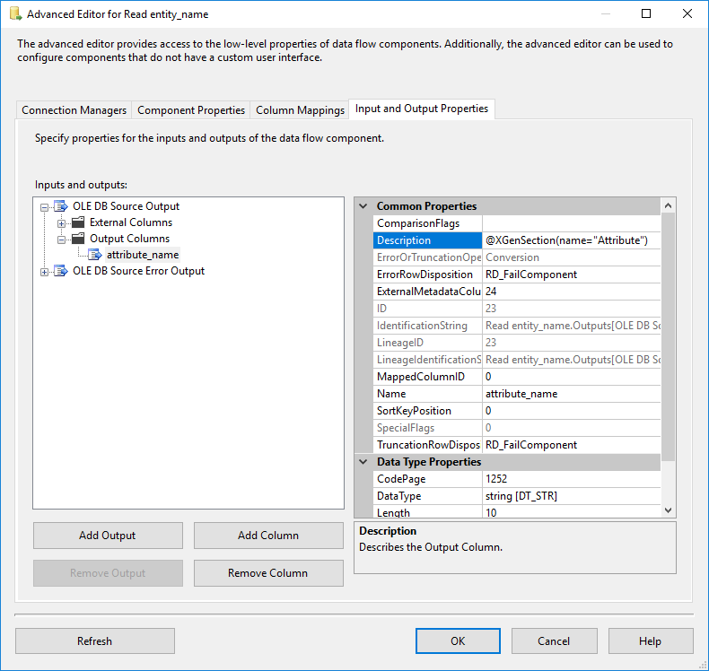

###### Input and Output Properties - Error Output Columns
And again the same of the 'OLDE DB Source Error Output' output columns.

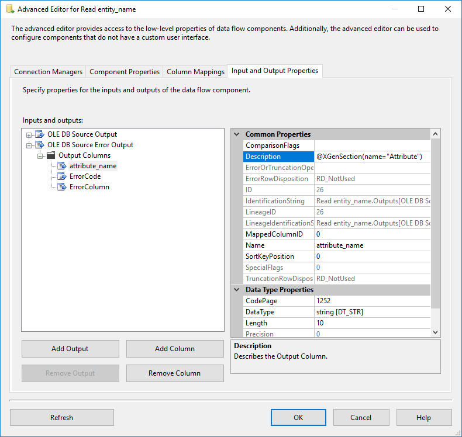

##### Destination
###### Connection Manager
Also for the Destination connection manager, nothing particular needs to be specified for CrossGenerate.

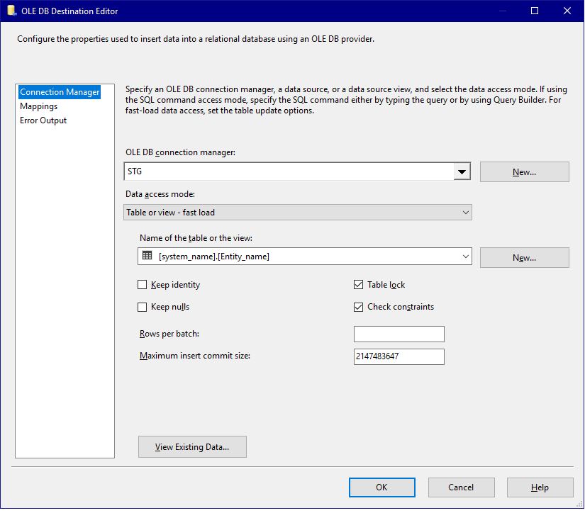

###### Mappings
In the mappings tab we make sure all columns are mapped. Here the mapping of the attribute_name column should be repeated for every attribute specified in the model. As with the source component we cannot specify an annotation in this screen, for this we need to open the 'Advanced Editor'.

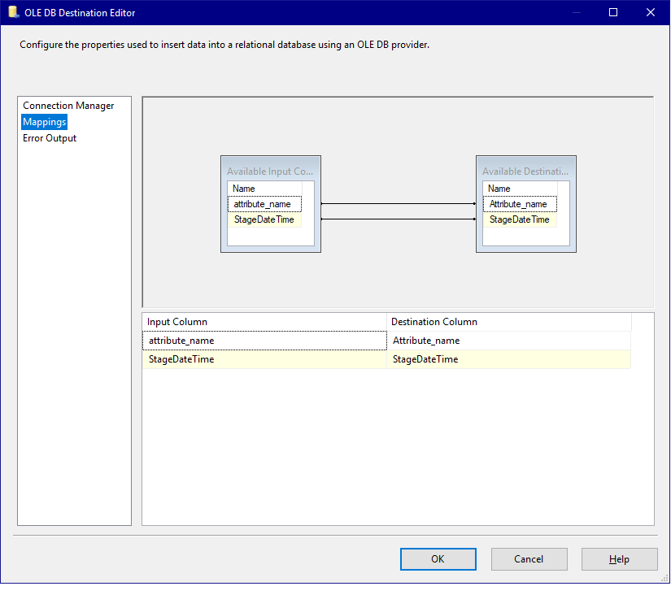

###### Input and Output Properties - External Columns
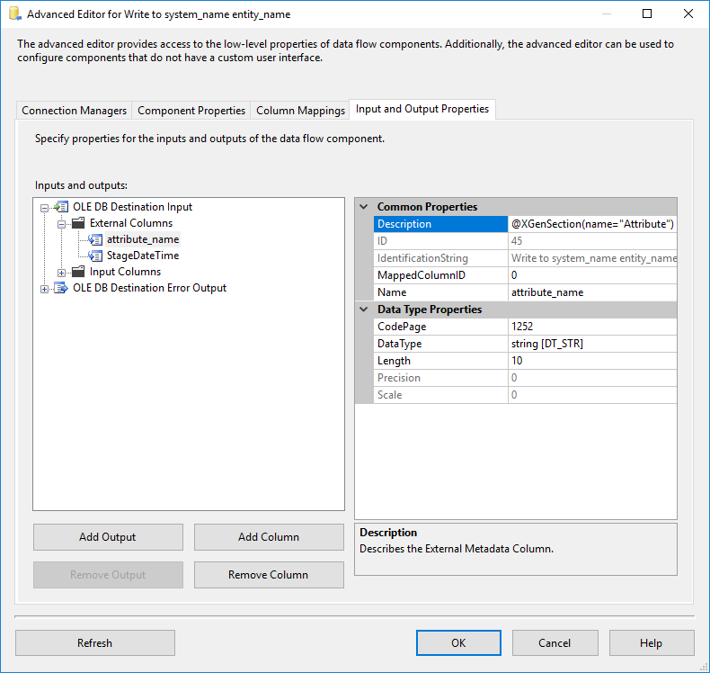

###### Input and Output Properties - Input Columns
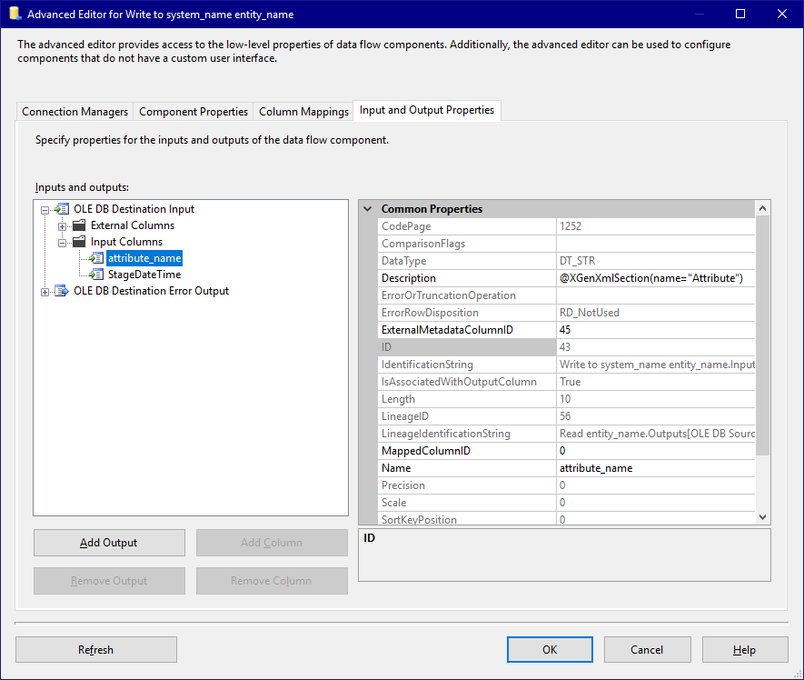


## Config

!!! todo
    Describe the ModelAttributeInjection, Section, TemplateAttributeInjection and TemplatePlaceholderInjection and why.

```xml
<?xml version="1.0" encoding="UTF-8"?>
<XGenConfig>
  <Model>    
    <ModelAttributeInjections>
      <!-- Translate the SQL data type into the SSIS data type and store it in the 'etldatatype' attribute on the attribute elements in the model. -->
      <ModelAttributeInjection modelXPath="//attribute[@datatype='varchar']" targetAttribute="etldatatype" targetValue="str"/>
      <ModelAttributeInjection modelXPath="//attribute[@datatype='varchar']" targetAttribute="codePage" targetValue="1252"/>
      <ModelAttributeInjection modelXPath="//attribute[@datatype='nvarchar']" targetAttribute="etldatatype" targetValue="wstr"/>
      <ModelAttributeInjection modelXPath="//attribute[@datatype='nvarchar']" targetAttribute="codePage" targetValue="1252"/>
      <ModelAttributeInjection modelXPath="//attribute[@datatype='tinyint']" targetAttribute="etldatatype" targetValue="i2"/>
      <ModelAttributeInjection modelXPath="//attribute[@datatype='smallint']" targetAttribute="etldatatype" targetValue="i2"/>
      <ModelAttributeInjection modelXPath="//attribute[@datatype='bigint']" targetAttribute="etldatatype" targetValue="i8"/>
      <ModelAttributeInjection modelXPath="//attribute[@datatype='int']" targetAttribute="etldatatype" targetValue="i4"/>
      <ModelAttributeInjection modelXPath="//attribute[@datatype='timestamp']" targetAttribute="etldatatype" targetValue="bytes"/>
      <ModelAttributeInjection modelXPath="//attribute[@datatype='datetime']" targetAttribute="etldatatype" targetValue="dbTimeStamp"/>
      <ModelAttributeInjection modelXPath="//attribute[@datatype='datetime2']" targetAttribute="etldatatype" targetValue="dbTimeStamp"/>
      <ModelAttributeInjection modelXPath="//attribute[@datatype='decimal']" targetAttribute="etldatatype" targetValue="numeric"/>
      <ModelAttributeInjection modelXPath="//attribute[@datatype='bit']" targetAttribute="etldatatype" targetValue="bool"/>
      <ModelAttributeInjection modelXPath="//attribute[@datatype='uniqueidentifier']" targetAttribute="etldatatype" targetValue="guid"/>
    </ModelAttributeInjections>
  </Model>
  <Template rootSectionName="StgPackage">
    <!-- Define the FileFormat, here all attributes with the name 'description' are scanned for annotations. -->
    <FileFormat templateType="xml" currentAccessor="_" commentNodeXPath="@*[lower-case(local-name())='description']" annotationPrefix="@XGen" annotationArgsPrefix="(" annotationArgsSuffix=")" />
    <!-- Output a SSIS package per element of the root section, so 1 package per entity. -->
    <Output type="output_per_element" />
    <Sections>
      <!-- The input columns of the 'OLE DB Destination Input' need to be repeated for every attribute. -->
      <!-- This element doesn't have a 'Description' attribute, so we need to create this section in this config file. -->
      <Section name="Attribute" templateXPath="//input[@name='OLE DB Destination Input']/inputColumns/inputColumn[@cachedName='attribute_name']"/>
    </Sections>
    <TemplateAttributeInjections>
      <!-- Inject an attribute for the scale, precision, cachedScale & cachedPrecision on elements where the name is 'attribute_name'. -->
      <TemplateAttributeInjection parentNodeXPath="//*[@name='attribute_name']" attributeName="scale" defaultValue=""/>
      <TemplateAttributeInjection parentNodeXPath="//*[@name='attribute_name']" attributeName="precision" defaultValue=""/>
      <TemplateAttributeInjection parentNodeXPath="//*[@name='attribute_name']" attributeName="cachedScale" defaultValue=""/>
      <TemplateAttributeInjection parentNodeXPath="//*[@name='attribute_name']" attributeName="cachedPrecision" defaultValue=""/>
    </TemplateAttributeInjections>
    <TemplatePlaceholderInjections>
      <!-- Inject a placeholder for the dataType, length, precision, scale, codePage attributes for the columns. -->
      <TemplatePlaceholderInjection templateXPath="//*[@name='attribute_name']/@dataType"  modelNode="etldatatype" scope="current" />
      <TemplatePlaceholderInjection templateXPath="//*[@name='attribute_name']/@length"  modelNode="length" scope="current" />
      <TemplatePlaceholderInjection templateXPath="//*[@name='attribute_name']/@precision"  modelNode="precision" scope="current" />
      <TemplatePlaceholderInjection templateXPath="//*[@name='attribute_name']/@scale"  modelNode="scale" scope="current" />
      <TemplatePlaceholderInjection templateXPath="//*[@name='attribute_name']/@codePage"  modelNode="codePage" scope="current" />
      <!-- Inject a placeholder for the cachedDataType, cachedLength, cachedPrecision, cachedScale, cachedCodePage attributes for the columns. -->
      <TemplatePlaceholderInjection templateXPath="//*[@name='attribute_name']/@cachedDataType" modelNode="etldatatype" scope="current" />
      <TemplatePlaceholderInjection templateXPath="//*[@name='attribute_name']/@cachedLength"  modelNode="length" scope="current" />
      <TemplatePlaceholderInjection templateXPath="//*[@name='attribute_name']/@cachedPrecision"  modelNode="precision" scope="current" />
      <TemplatePlaceholderInjection templateXPath="//*[@name='attribute_name']/@cachedScale"  modelNode="scale" scope="current" />
      <TemplatePlaceholderInjection templateXPath="//*[@name='attribute_name']/@cachedCodePage"  modelNode="codePage" scope="current" />
    </TemplatePlaceholderInjections>
  </Template>
 <Binding>
   <!-- Create a binding between the 'StgPackage' sections in the template and the 'entity' elements in the model. -->
   <SectionModelBinding section="StgPackage" modelXPath="/modeldefinition/system/mappableObjects/entity" placeholderName="entity">
     <Placeholders>
       <!-- Create the 'system' placeholder within the 'StgPackage' section. -->
       <Placeholder name="system" modelXPath="../.." />                 
     </Placeholders>
     <!-- Create a binding between the 'Attribute' sections in the template and the 'attribute' elements in the model. -->
     <SectionModelBinding section="Attribute" modelXPath="attributes/attribute" placeholderName="attribute">
       <Placeholders>
         <!-- Create the 'system' placeholder within the 'Attribute' section. -->
         <Placeholder name="system" modelXPath="../../../.." />
         <!-- Create the 'entity' placeholder within the 'Attribute' section. -->
         <Placeholder name="entity" modelXPath="../.." />                 
       </Placeholders>    
     </SectionModelBinding>        
   </SectionModelBinding>
 </Binding>
</XGenConfig>
```

## Output
When running CrossGenerate the output using the given Model, Template and Config will be the following files:

- stg_load_ExampleSource_Customer.dtsx
- stg_load_ExampleSource_Order.dtsx

To test the packages, copy the template solution into a new folder.
Open the solution and add the generated packages to the SSIS project.
Updated the Source & Staging connection to the real Source & Staging databases which contain the Customer & Order tables.

### stg_load_ExampleSource_Customer.dtsx

#### Control Flow
[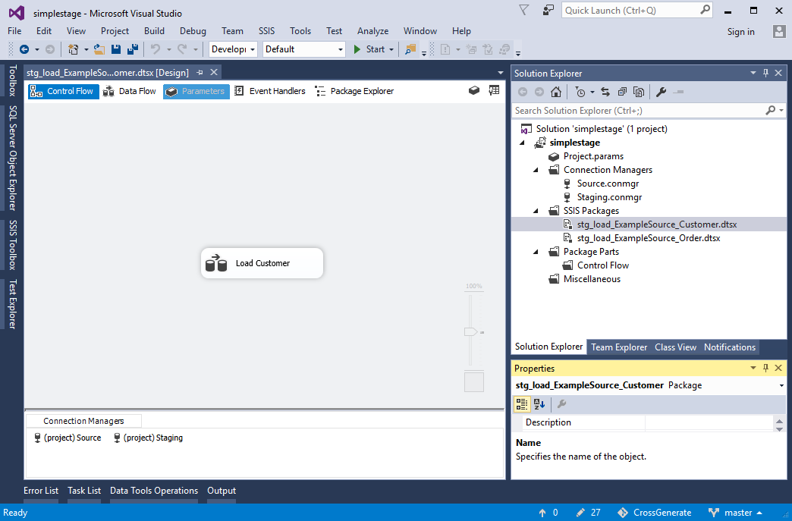](img/output_control_flow.png)

!!! info
    The annotation, which in the template is in the Description property, is now removed.

#### Data Flow
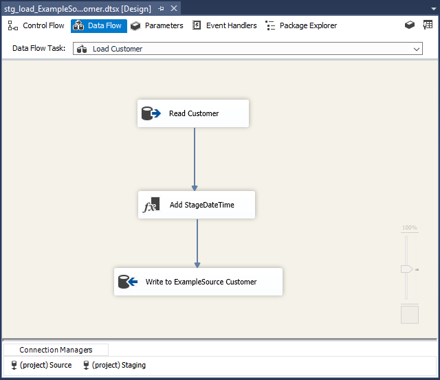

##### Source

###### Connection Manager
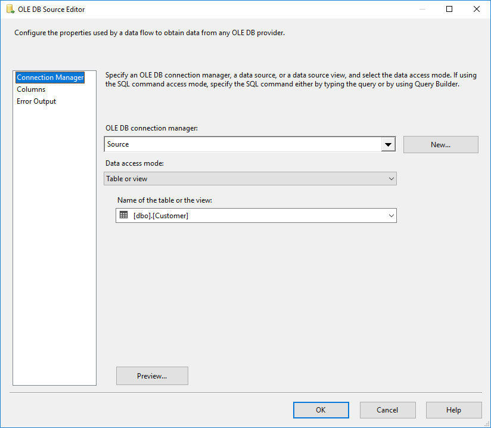

###### Columns
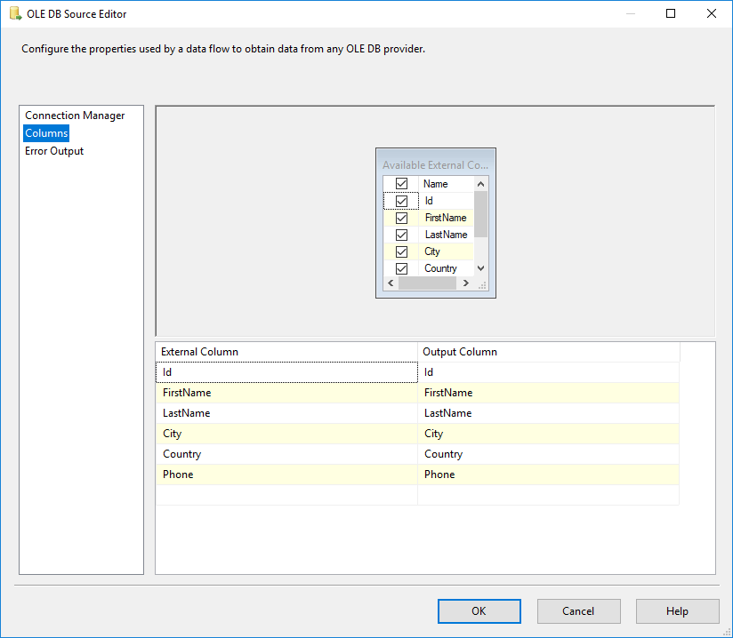

###### Input and Output Properties
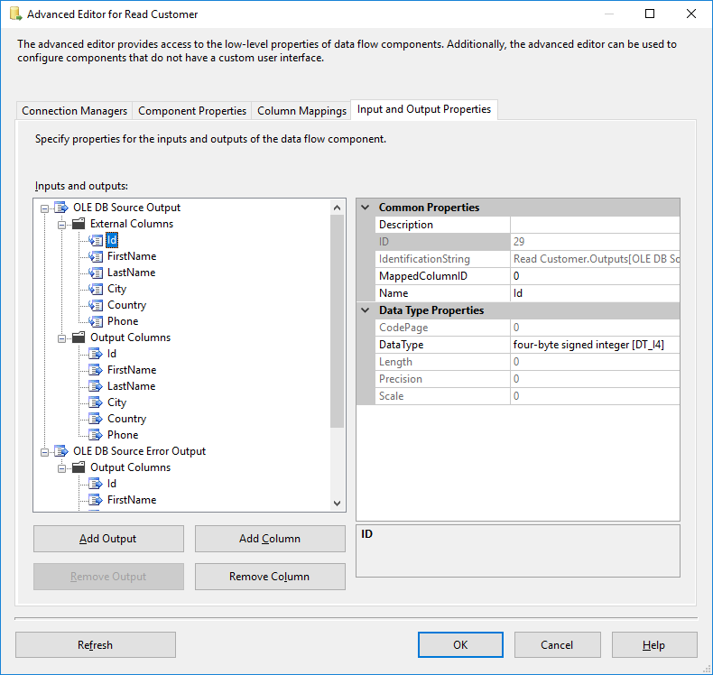

##### Destination

###### Connection Manager
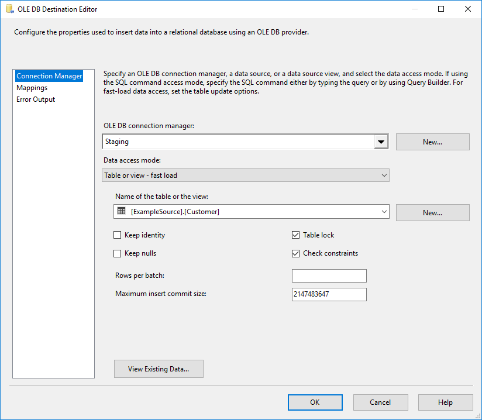

###### Mappings
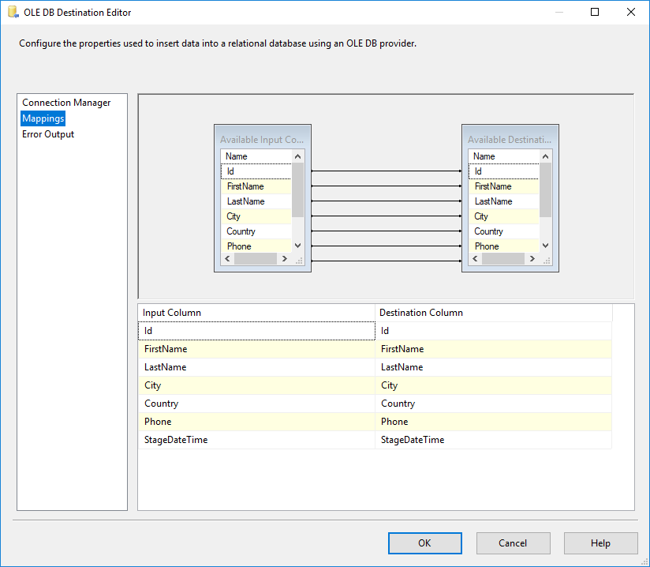

###### Input and Output Properties
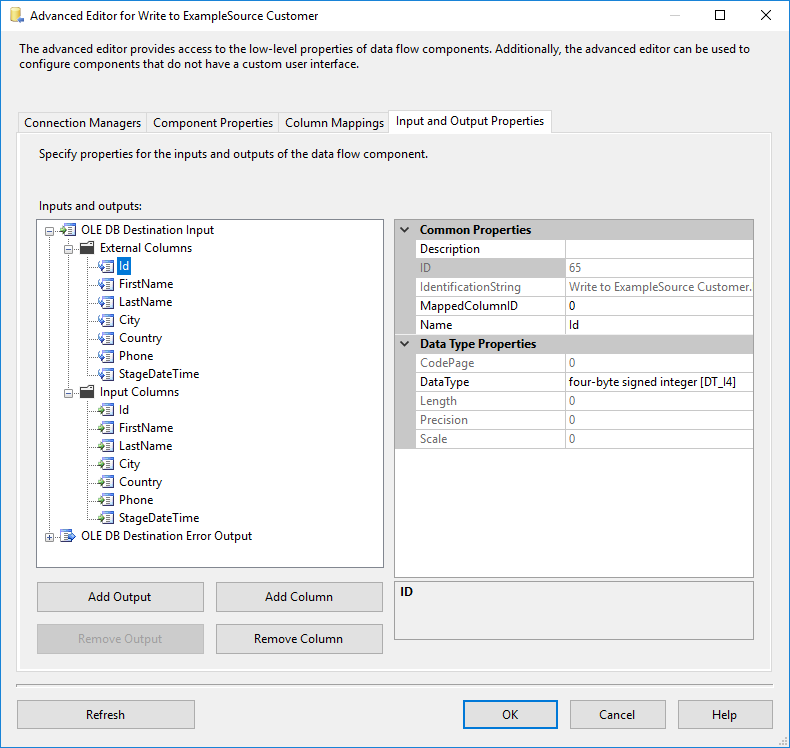

#### Execution
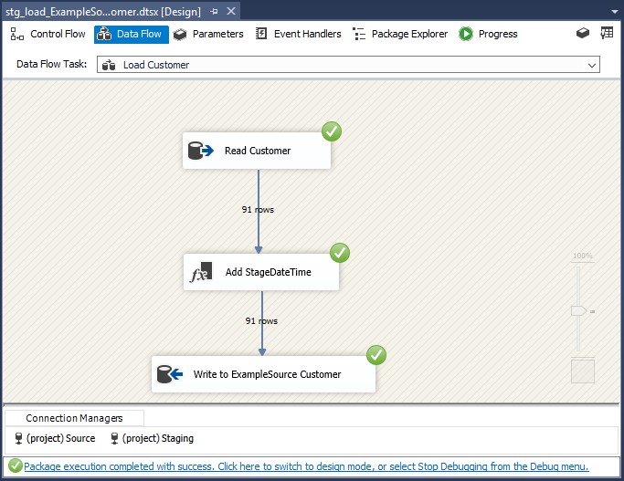

## Attachments
The sample solution with the template database scripts & SSIS package can be found in the following zip file:

- [CrossGenerate_Example_SSIS_Simple_staging.zip](CrossGenerate_Example_SSIS_Simple_staging.zip)