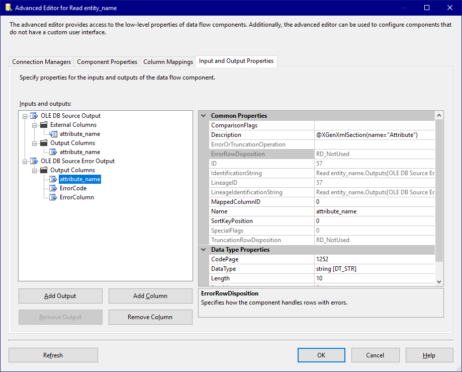
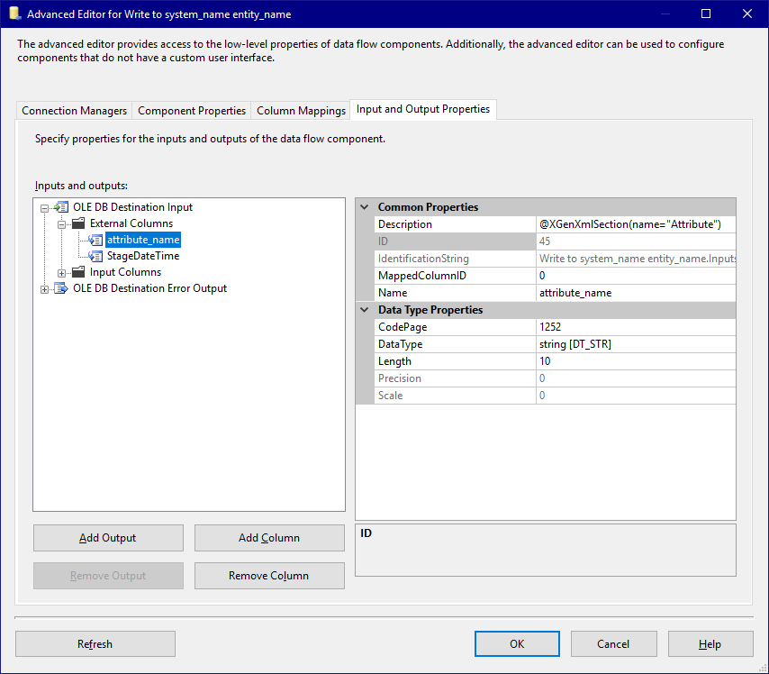

# Microsoft SSIS - Simple staging example

## Model
For this stage package the [Source model](../Model/Source_model) is used.

## Template
A SSIS package is created with the following components (note the @XGenSection annotations in the description fields of various components):

### Control flow
We have a staging package which needs to be created for every entity in our model. Because of this we want the create a section using the Control Flow of the SSIS package. So we click on the grey area of the package and add the annotation `@XGenSection(name="stgPackage")` in the `Description` property.

On the Control Flow we have a Data Flow Task with the name 'Load entity_name'. In the configuration for CrossGenerate we will bind the `entity` elements on the `stgPackage` section so the `entity_name` is resolved correctly.


### Dataflow
In the DataFlow task of this template we have:
- A OLE DB Source component to retrieve the data from the source table
- A Derive Column component to add the StageDateTime as a column to the output
- A OLE DB Destination component to write the data to the target table.

Here the `system_name` and `entity_name` placeholders will be resolved automatically, since these component are withing the `stgPackage` section.


#### Source
In the OLE DB Source component we go through the different screens and set the CrossGenerate annotations accordingly.

##### Connection manager
In the connection manager screen we don't need to set anything specific for CrossGenerate, we make sure the connection is set correctly and the right source table is selected.


##### Columns
In the 'Columns' tab here we also don't need to set anything specific for CrossGenerate. The attribute which needs to be repeated for every attribute in the model needs to be there and selected. We can't specify a section here in this  screen, but we will do this using the  Advanced Editor of the source component.


##### Input and Output Properties - External Columns
When opening the Advanced Editor for the source component we can go to the 'Input and Output Properties' tab to find the 'attribute_name' column in the 'External Columns' list.
The defined output column needs to be repeated for every attribute in our model, so we set the section named 'Attribute' on the [External Columns/attribute_name] element. This way CrossGenerate knows which part in the template to repeat (in this case the [attribute_name] column).


##### Input and Output Properties - Output Columns
We do the same for the 'Output Columns', since this column also needs to be repeat for every attribute defined in the model.


##### Input and Output Properties - Error Output Columns
And again the same of the 'OLDE DB Source Error Output' output columns.



#### Target
##### Connection Manager
Also for the target connection manager, nothing particular needs to be specified for CrossGenerate.


##### Mappings
In the mappings tab we make sure all columns are mapped. Here the mapping of the attribute_name column should be repeated for every attribute specified in the model. As with the source component we cannot specify an annotation in this screen, for this we need to open the 'Advanced Editor'.

!!! todo
    Update screenshots with the correct column name in the target table. 'Attribute_name' should be 'attribute_name' here.


##### Input and Output Properties - External Columns


##### Input and Output Properties - Input Columns


##### Input and Output Properties - Error Output Columns

!!! todo
    This screenshot is missing. The attribute is on the Output Columns right?


## Config

```xml
<?xml version="1.0" encoding="UTF-8"?>
<XGenConfig>
  <Model>    
    <ModelAttributeInjections>
      <!-- Here we inject the attribute etldatatype into the attribute elements where the datatype is varchar. -->
      <ModelAttributeInjection modelXPath="//attribute[@datatype='varchar']" targetAttribute="etldatatype" targetValue="str"/>
      <!-- Here we inject the attribute etldatatype into the attribute elements where the datatype is nvarchar. -->
      <ModelAttributeInjection modelXPath="//attribute[@datatype='nvarchar']" targetAttribute="etldatatype" targetValue="wstr"/>
    </ModelAttributeInjections>
  </Model>
  <Template rootSectionName="stgPackage">
    <!-- Here we specify the file format of the template. An annotation for example can be specified in 'description' attributes of any element (commentNodeXPath). -->
    <FileFormat templateType="xml" currentAccessor="_" commentNodeXPath="@*[lower-case(local-name())='description']" annotationPrefix="@XGen" annotationArgsPrefix="(" annotationArgsSuffix=")" />
    <!-- Here we specify the output type is output_per_element, so we get a SSIS package per entity. -->
    <Output type="output_per_element" />
    <TemplatePlaceholderInjections>
      <!--  Here we inject the etldatatype placeholder for the cachedDataType attribute of every inputColumn element. -->
      <TemplatePlaceholderInjection templateXPath="//inputColumn/@cachedDataType" modelNode="etldatatype" scope="current" />
      <!--  Here we inject the etldatatype placeholder for the dataType attribute of every outputColumn element. -->
      <TemplatePlaceholderInjection templateXPath="//outputColumn/@dataType"  modelNode="etldatatype" scope="current" />
    </TemplatePlaceholderInjections>
  </Template>
  <Binding>
    <!-- Here we define the stgPackage section model binding. This section maps to the 'Control Flow' of the package. -->
    <SectionModelBinding section="stgPackage" modelXPath="/modeldefinition/system/mappableObjects/entity" placeholderName="entity">
      <Placeholders>
        <!-- For the placeholder the modelXPath is relative to its section model xpath. -->
        <Placeholder name="system" modelXPath="../.." />                 
      </Placeholders>
      <!-- Here we defined the binding of the 'Attribute' section to ever attribute of the entity. -->
      <SectionModelBinding section="Attribute" modelXPath="attributes/attribute" placeholderName="attribute">
        <Placeholders>
          <Placeholder name="system" modelXPath="../../../../" />
          <Placeholder name="entity" modelXPath="../../" />                 
        </Placeholders>    
      </SectionModelBinding>        
     </SectionModelBinding> 
  </Binding>
</XGenConfig>
```

## Output

!!! todo
    Describe the output.