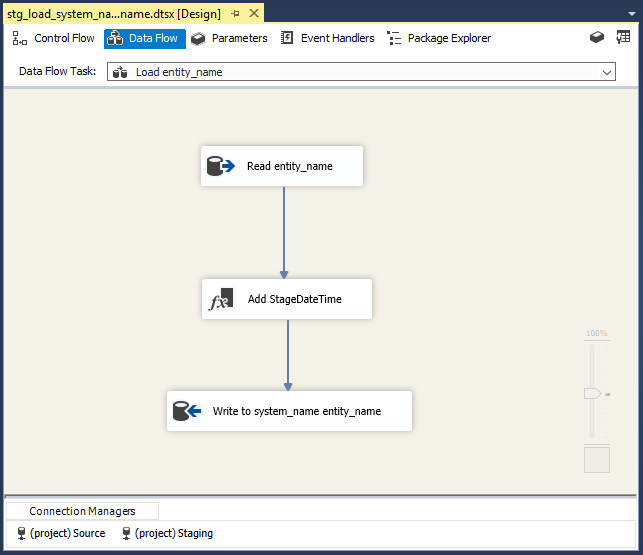
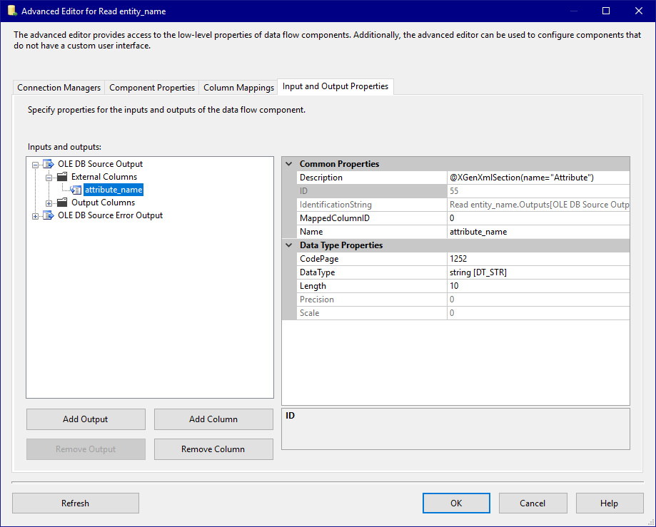
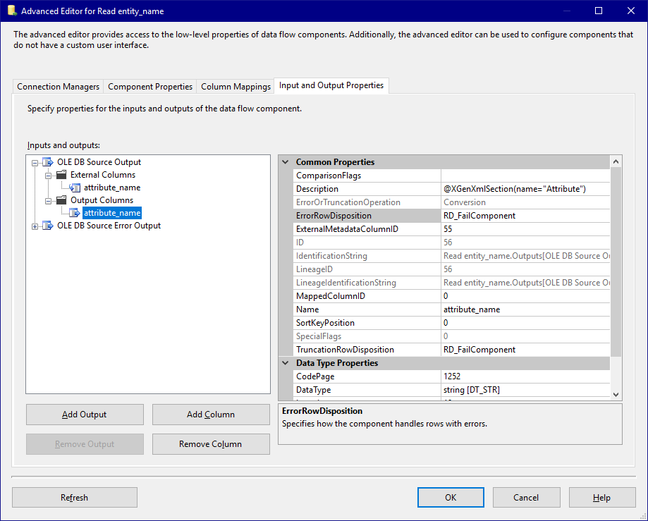
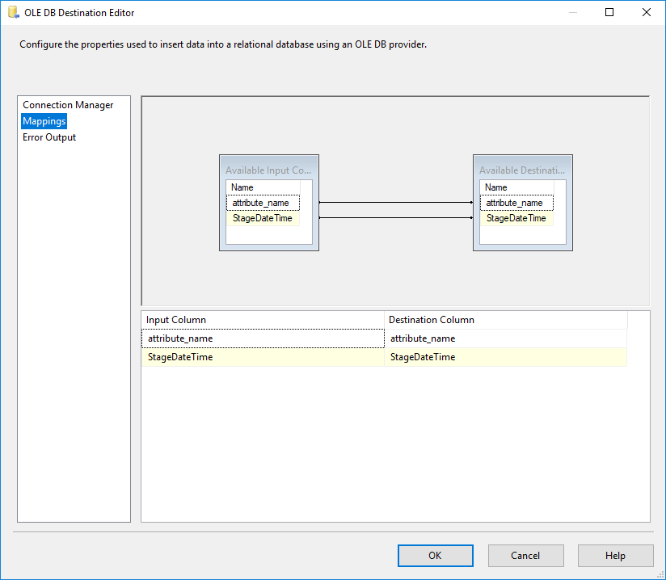

# Microsoft SSIS - Simple staging example

## Model
For this stage package the [Source model](../Model/Source_model) is used.

## Template

### stg_load_system_name_entity_name.dtsx

A SSIS package is created with the following components (note the @XGenXmlSection annotations in the description fields of various components):

#### Control Flow
On the Control Flow we have a Data Flow Task with the name 'Load System_name Entity_name'. During generation this will be resolved to the proper system and entity names.

[](img/control_flow.png)

#### Data Flow
In the DataFlow task of this template we have:
- A OLE DB Source component to retrieve the data from the source table
- A Derive Column component to add the StageDateTime as a column to the output
- A OLE DB Destination component to write the data to the Destination table.

Again the `system_name` and `entity_name` placeholders are used.



##### Source
In the OLE DB Source component we go through the different screens and set the CrossGenerate annotations accordingly.

###### Connection Manager
In the connection manager screen we don't need to set anything specific for CrossGenerate, we make sure the connection is set correctly and the right source table is selected.


###### Columns
In the 'Columns' tab here we also don't need to set anything specific for CrossGenerate. The attribute which needs to be repeated for every attribute in the model needs to be there and selected. We can't specify a section here in this  screen, but we will do this using the  Advanced Editor of the source component.


###### Input and Output Properties - External Columns
When opening the Advanced Editor for the source component we can go to the 'Input and Output Properties' tab to find the 'Attribute_name' column in the 'External Columns' list.
The defined output column needs to be repeated for every attribute in our model, so we set the section named 'Attribute' on the [External Columns/attribute_name] element. This way CrossGenerate knows which part in the template to repeat (in this case the [Attribute_name] column).



###### Input and Output Properties - Output Columns
We do the same for the 'Output Columns', since this column also needs to be repeat for every attribute defined in the model.



###### Input and Output Properties - Error Output Columns
And again the same of the 'OLDE DB Source Error Output' output columns.


##### Derived column
The derived colum transformation does not need any specific configuration for Crossgenerate.


##### Destination
###### Connection Manager
Also for the Destination connection manager, nothing particular needs to be specified for CrossGenerate.


###### Mappings
In the mappings tab we make sure all columns are mapped. Here the mapping of the attribute_name column should be repeated for every attribute specified in the model. As with the source component we cannot specify an annotation in this screen, for this we need to open the 'Advanced Editor'.



###### Input and Output Properties - External Columns


###### Input and Output Properties - Input Columns


### Documentation
For documentation on templates, please see [Template](../../Template).


## Config

### Enrich the model with SSIS datatypes using Model Attribute Injection
The model used as input for this example contains columns that are specified with a database-datatype (varchar, int, datetime etc).
SSIS uses it's own set of datatypes.
For the model to be used to map to a SSIS template, first the model needs to be enriched with SSIS datatype characteristics.
This model enrichment is done using a specific CrossGenerate feature named Model Attribute Injection.
This feature enables adding attributes to elements in the model.

Model Attribute Injection is configured in the first part of the config shown below: Each database datatype used in the model is mapped to its corresponding SSIS datatype.
This SSIS datatype is stored in the etldatatype XML attribute of the model's attribute.
For attributes of varchar or nvarchar datatypes an additional attribute is injected with the codePage (with a value of 1252).
The xml snippet below shows an example of Model Attribute Injection configuration.

```xml
<ModelAttributeInjection
  modelXPath="//attribute[@datatype='varchar']"
  targetAttribute="etldatatype"
  targetValue="str"
/>
<ModelAttributeInjection
  modelXPath="//attribute[@datatype='varchar']"
  targetAttribute="codePage"
  targetValue="1252"
/>   
```

### Prepare the SSIS template package using Template Attribute Injection and Template Placeholder Injection
Before code can be generated using the SSIS template package and the enriched model, some alterations need to be performed on the SSIS template package:

- Parts in the SSIS template that are mapped to a model attribute (column) need to be extended with XML attributes that might be needed.
- Some attributes in the SSIS templates that have concrete values need to be populated using a placeholder.

#### Add attributes using Template Attribute Injection
Similar to Model Attribute Injection, parts of a template can also be extended with properties.
For this Template Attribute Injection can be configured in CrossGenerate.

In the example configuration below the attributes `scale`, `precision`, `cachedScale` and `cachedPrecision` are added to each node that has an attribute name with value `attribute_name`.
These attributes are injected so that, when a attribute/column is applied on the template that has scale or precision specifications, these can be mapped to the template.
An example of Template Attribute Injection:

```xml
<TemplateAttributeInjection
  templateXPath="//*[@name='attribute_name']" 
  attributeName="scale" 
  attributeValue=""
/>
```

#### Add placeholders to a template using Template Placeholder Injection
When developing a template SSIS package, a lot of elements can be made abstract using Visual Studio Data Tools.
This means that for table or column names, a SSIS package can be developed against an abstract datamodel.
So the SSIS package is build using placeholder names, which automatically makes it a template (for example 'attribute_name').

Other elements, for example data types, length & precision cannot be made abstract; the IDE requires you to specify concrete, existing datatypes and lengths for columns.
When applying a model to a template SSIS package, it is required that the data type, length and other characteristics are substituted from the model.
This is only possible if the elements that need to be subsituted contain placeholders in the SSIS template package.

Template Placeholder Injections enables inserting placeholders in a template in parts that cannot be made abstract from the IDE.
An example of a template placeholder injection is shown below:

```xml
<TemplatePlaceholderInjection 
  templateXPath="//*[@name='attribute_name']/@dataType"  
  modelNode="etldatatype" 
  scope="current"
/>
``` 

The example looks for all elements in the template that have a `name` attribute with value `attribute_name`.
For these elements the dataType attribute is populated with a placeholder referencing the `etldatatype` attribute from the model.

#### Specifying additional sections
As can be seen in the config below, there is a section defined named `Attribute` that references input columns for an OLE DB Destination Input.
This section is defined in the config since the input columns on the OLE DB Destination input cannot be given a section annotation in the IDE.

```xml
<XmlSection
  name="Attribute" 
  templateXPath="//input[@name='OLE DB Destination Input']/inputColumns/inputColumn[@cachedName='attribute_name']"
/>
```
#### Configure binding
The sections in the template need to be bound to parts in the model. Since the complete ssis package needs to be generated for each entity in the model. The templates `rootSectionName` is named `Entity`. The section(s) named Entity are mapped to entity in the model. The section(s) named Attribute are mapped to attribute. Mapping template sections to parts of the model is done using `SectionBinding`.
For each SectionModelBinding, additional placeholders can be specified to access other parts of the model from within that section scope.

```xml
<Binding>
    <SectionModelBinding section="Entity" modelXPath="/modeldefinition/system/mappableObjects/entity" placeholderName="Entity">
      <Placeholders>
        <Placeholder name="System" modelXPath="../.." />
      </Placeholders>
      <SectionModelBinding section="Attribute" modelXPath="attributes/attribute" placeholderName="Attribute">
        <Placeholders>
          <Placeholder name="Entity" modelXPath="../.." />
        </Placeholders>
      </SectionModelBinding>      
    </SectionModelBinding>
  </Binding>
```
### Full config example

```xml
<?xml version="1.0" encoding="UTF-8"?>
<XGenConfig>
  <Model>    
    <ModelAttributeInjections>
      <!-- Translate the SQL data type into the SSIS data type and store it in the 'etldatatype' attribute on the attribute elements in the model. -->
      <ModelAttributeInjection modelXPath="//attribute[@datatype='varchar']" targetAttribute="etldatatype" targetValue="str"/>
      <ModelAttributeInjection modelXPath="//attribute[@datatype='varchar']" targetAttribute="codePage" targetValue="1252"/>
      <ModelAttributeInjection modelXPath="//attribute[@datatype='nvarchar']" targetAttribute="etldatatype" targetValue="wstr"/>
      <ModelAttributeInjection modelXPath="//attribute[@datatype='nvarchar']" targetAttribute="codePage" targetValue="1252"/>
      <ModelAttributeInjection modelXPath="//attribute[@datatype='tinyint']" targetAttribute="etldatatype" targetValue="i2"/>
      <ModelAttributeInjection modelXPath="//attribute[@datatype='smallint']" targetAttribute="etldatatype" targetValue="i2"/>
      <ModelAttributeInjection modelXPath="//attribute[@datatype='bigint']" targetAttribute="etldatatype" targetValue="i8"/>
      <ModelAttributeInjection modelXPath="//attribute[@datatype='int']" targetAttribute="etldatatype" targetValue="i4"/>
      <ModelAttributeInjection modelXPath="//attribute[@datatype='timestamp']" targetAttribute="etldatatype" targetValue="bytes"/>
      <ModelAttributeInjection modelXPath="//attribute[@datatype='datetime']" targetAttribute="etldatatype" targetValue="dbTimeStamp"/>
      <ModelAttributeInjection modelXPath="//attribute[@datatype='datetime2']" targetAttribute="etldatatype" targetValue="dbTimeStamp"/>
      <ModelAttributeInjection modelXPath="//attribute[@datatype='decimal']" targetAttribute="etldatatype" targetValue="numeric"/>
      <ModelAttributeInjection modelXPath="//attribute[@datatype='bit']" targetAttribute="etldatatype" targetValue="bool"/>
      <ModelAttributeInjection modelXPath="//attribute[@datatype='uniqueidentifier']" targetAttribute="etldatatype" targetValue="guid"/>
    </ModelAttributeInjections>
  </Model>
  <XmlTemplate rootSectionName="StgPackage">
    <!-- Define the FileFormat, here all attributes with the name 'description' are scanned for annotations. -->
    <FileFormat currentAccessor="_" commentNodeXPath="@description" annotationPrefix="@XGen" annotationArgsPrefix="(" annotationArgsSuffix=")" />
    <!-- Output a SSIS package per element of the root section, so 1 package per entity. -->
    <Output type="output_per_element" />
    <XmlSections>
      <!-- The input columns of the 'OLE DB Destination Input' need to be repeated for every attribute. -->
      <!-- This element doesn't have a 'Description' attribute, so we need to create this section in this config file. -->
      <XmlSection name="Attribute" templateXPath="//input[@name='OLE DB Destination Input']/inputColumns/inputColumn[@cachedName='attribute_name']"/>
    </XmlSections>
    <TemplateAttributeInjections>
      <!-- Inject an attribute for the scale, precision, cachedScale & cachedPrecision on elements where the name is 'attribute_name'. -->
      <TemplateAttributeInjection templateXPath="//*[@name='attribute_name']" attributeName="scale" attributeValue=""/>
      <TemplateAttributeInjection templateXPath="//*[@name='attribute_name']" attributeName="precision" attributeValue=""/>
      <TemplateAttributeInjection templateXPath="//*[@name='attribute_name']" attributeName="cachedScale" attributeValue=""/>
      <TemplateAttributeInjection templateXPath="//*[@name='attribute_name']" attributeName="cachedPrecision" attributeValue=""/>
    </TemplateAttributeInjections>
    <TemplatePlaceholderInjections>
      <!-- Inject a placeholder for the dataType, length, precision, scale, codePage attributes for the columns. -->
      <TemplatePlaceholderInjection templateXPath="//*[@name='attribute_name']/@dataType"  modelNode="etldatatype" scope="current" />
      <TemplatePlaceholderInjection templateXPath="//*[@name='attribute_name']/@length"  modelNode="length" scope="current" />
      <TemplatePlaceholderInjection templateXPath="//*[@name='attribute_name']/@precision"  modelNode="precision" scope="current" />
      <TemplatePlaceholderInjection templateXPath="//*[@name='attribute_name']/@scale"  modelNode="scale" scope="current" />
      <TemplatePlaceholderInjection templateXPath="//*[@name='attribute_name']/@codePage"  modelNode="codePage" scope="current" />
      <!-- Inject a placeholder for the cachedDataType, cachedLength, cachedPrecision, cachedScale, cachedCodePage attributes for the columns. -->
      <TemplatePlaceholderInjection templateXPath="//*[@name='attribute_name']/@cachedDataType" modelNode="etldatatype" scope="current" />
      <TemplatePlaceholderInjection templateXPath="//*[@name='attribute_name']/@cachedLength"  modelNode="length" scope="current" />
      <TemplatePlaceholderInjection templateXPath="//*[@name='attribute_name']/@cachedPrecision"  modelNode="precision" scope="current" />
      <TemplatePlaceholderInjection templateXPath="//*[@name='attribute_name']/@cachedScale"  modelNode="scale" scope="current" />
      <TemplatePlaceholderInjection templateXPath="//*[@name='attribute_name']/@cachedCodePage"  modelNode="codePage" scope="current" />
    </TemplatePlaceholderInjections>
  </XmlTemplate>
 <Binding>
   <!-- Create a binding between the 'StgPackage' sections in the template and the 'entity' elements in the model. -->
   <SectionModelBinding section="StgPackage" modelXPath="/modeldefinition/system/mappableObjects/entity" placeholderName="entity">
     <Placeholders>
       <!-- Create the 'system' placeholder within the 'StgPackage' section. -->
       <Placeholder name="system" modelXPath="../.." />                 
     </Placeholders>
     <!-- Create a binding between the 'Attribute' sections in the template and the 'attribute' elements in the model. -->
     <SectionModelBinding section="Attribute" modelXPath="attributes/attribute" placeholderName="attribute">
       <Placeholders>
         <!-- Create the 'system' placeholder within the 'Attribute' section. -->
         <Placeholder name="system" modelXPath="../../../.." />
         <!-- Create the 'entity' placeholder within the 'Attribute' section. -->
         <Placeholder name="entity" modelXPath="../.." />                 
       </Placeholders>    
     </SectionModelBinding>        
   </SectionModelBinding>
 </Binding>
</XGenConfig>
```

### Documentation
For documentation on the configuration, please see [Config](../../Config).

## Output
When running CrossGenerate the output using the given Model, Template and Config will be the following files:

- stg_load_ExampleSource_Customer.dtsx
- stg_load_ExampleSource_Order.dtsx

To test the packages, copy the template solution into a new folder.
Open the solution and add the generated packages to the SSIS project.
Updated the Source & Staging connection to the real Source & Staging databases which contain the Customer & Order tables.

### stg_load_ExampleSource_Customer.dtsx

#### Control Flow
[](img/output_control_flow.png)

!!! info
    The annotation, which in the template is in the Description property, is now removed.

#### Data Flow


##### Source

###### Connection Manager


###### Columns


###### Input and Output Properties


##### Destination

###### Connection Manager


###### Mappings


###### Input and Output Properties


#### Execution


## Attachments
The sample solution with the template database scripts & SSIS package can be found in the following zip file:

- [CrossGenerate_Example_SSIS_Simple_staging.zip](CrossGenerate_Example_SSIS_Simple_staging.zip)