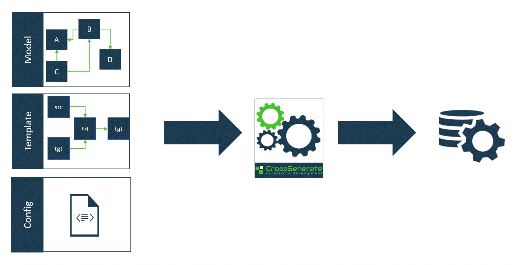

# Overview

## What CrossGenerate does
CrossGenerate can be used to generate software using a model driven approach.
For this the following three inputs need to be provided to CrossGenerate:

| Input                  | Description |
|:---                    |:---         |
| [Model](../Model)[^1]       | Specifying the functional specification of the software to be generated. |
| [Template](../Template)[^1] | Specifying a technical pattern that needs to be applied to parts of the model. |
| [Config](../Config)[^1]     | Specifying how the model and template need to be combined for the desired result. |

## Features
What distinguishes CrossGenerate from other automation products is that:

- It is highly customizable and generic. CrossGenerate does not incorporate model or ETL knowledge.
- Templates can be developed using well known ETL and database tools, for instance Microsoft SQL Server Integration Services, Informatica PowerCenter or IBM DataStage. 
- Since well known ETL and database tools can be used, requires little additional technical skills.
- Easily fits in existing architectures.

## How it works
When CrossGenerate is invoked with a model, template and config as input, it performs the following three steps:

- Preprocessing of the model
- Preprocessing of the template
- Combining model and template to generate software

Below is a graphical illustration of this process.

[comment]: Footnotes
[^1]: For more information on the specific input, click on the name.