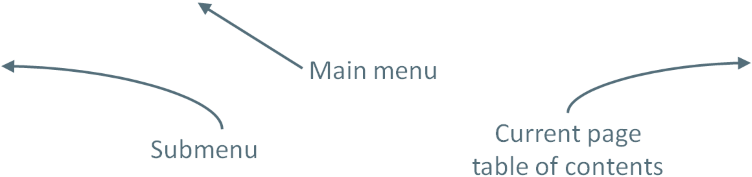

# Introduction
This wiki described the documentation of CrossGenerate.

To get started go to [Getting started](./GettingStarted)

## Shortkeys

| Shortkey | Description |
|:---      |:---         |
|<kbd>F</kbd> or <kbd>S</kbd> | Press the <kbd>F</kbd> or <kbd>S</kbd> key to start searching. |
| <kbd>Shift</kbd> + mouse scroll[^1] | Press the <kbd>Shift</kbd> key while scrolling to scroll horizontally. |

[comment]: Footnotes
[^1]: This can be handy when a code example is wide and doesn't fit within the boundaries of the page.